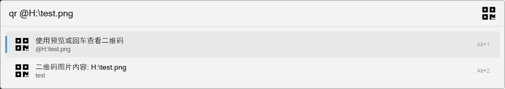

Flow.Launcher.Plugin.QrCodeGenerator
==================

## Flow.Launcher QR Code Generator
- 文本生成二维码插件/ Generator QRCode from Text 

A plugin for the [Flow launcher](https://github.com/Flow-Launcher/Flow.Launcher).


### Usage
#### 1. Generate QRCode
```
qr <arguments>

# example
qr test
```


- Press `Enter` Open a new Windows preview Qr Code.


#### 2. Parser QrCode File

```
qr @qrcodefilepath

# example
qr @H:\test.png
```



### Plugin Install Folder
```
%USERPROFILE%\AppData\Roaming\FlowLauncher\Plugins
```

### Install Location
#### 1. Create a Dir
```
%USERPROFILE%\AppData\Roaming\FlowLauncher\Plugins\QrCodeGenerator
```

#### 2. UnPackage ZIP file to Create Dir
```
%USERPROFILE%\AppData\Roaming\FlowLauncher\Plugins\QrCodeGenerator\Flow.Launcher.Plugin.QrCodeGenerator.dll
```
